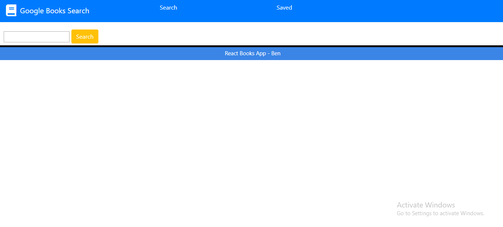

# Google-Books

- [User Story](#User-Story)
- [General Info](#General-Info)
- [Instructions](#Instructions)
- [Motivation](#Motivation)
- [Future Functionality](#Future-Functionality)
- [References](#References)

## User Story

As a user,
I want to be able to search for and save books that interest me,
so that I can have an enjoyable reading experience.

## General-Info

For this React assignment, we completed a functional Google Books API by utilizing React routing, util functions, and called React lifecycle methods. All usable components are coded into separate files and called when needed within the layout. The biggest part of this homework was accessing the Google-Books API and allowing a "Favorite" book function.

## Instructions

To successfully run this application you can:

Create an new React app using the Create React App or

Clone in this github repository

Type in the terminal type "npm i"

This app can then be opened in the terminal using "npm run start" or by visiting the deployed link at https://shrouded-cove-29201.herokuapp.com/

## Motivation

I was definitely motivated to continue our study on React, especially the file organization aspect. Incorporating a full MERN stack is an important step forward in this coding course and one that this project helped me to do.

## Future Functionality

Some future features for this application would include adding more content to each Book Card such as links to other sites or even a Genius book feature. I also think giving a sorting aspect for the page would improve the user experience.

## References

https://developers.google.com/books/docs/v1/getting_started

https://www.youtube.com/watch?v=Law7wfdg_ls&t=1024s

https://stackoverflow.com/questions/6226846/how-to-change-a-git-remote-on-heroku
